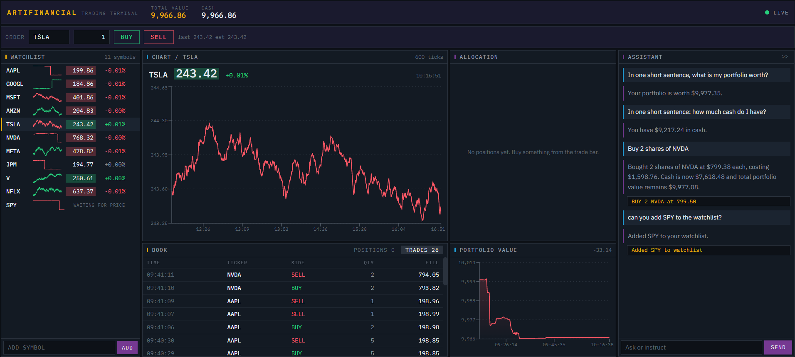

# Artifinancial — AI Trading Workstation

### [Open the live terminal](https://hubbersbi.github.io/artifinancial/)

No install and no key. The published build runs entirely in your browser - the
price simulator, the portfolio and the assistant - so nothing you do leaves your
machine.

Everything on that screen is simulated. The tickers are real companies, the
prices are a random walk, the $10,000 is imaginary and the assistant is a
scripted mock rather than a model. The site says so before it lets you in, and
keeps saying so in the header.



An AI-powered trading workstation: streaming prices, a simulated portfolio you can trade, and an LLM chat assistant that analyzes positions and executes trades from natural language. Prices come from a built-in market simulator, not a real feed.

Built by a team of six specialist coding agents — each owning a slice of the stack and working in parallel against a shared written interface contract — under my direction as architect and orchestrator

## Features

- **Streaming prices** with green/red flash animations — over SSE from the
  backend when containerised, from a simulator in the tab when published
- **Simulated portfolio** — $10k virtual cash, market orders, instant fills
- **Portfolio visualizations** — heatmap (treemap), P&L chart, positions table
- **AI chat assistant** — analyzes holdings, suggests and auto-executes trades.
  A real model when run with a Groq key; a scripted mock on the published site,
  which labels itself as one in every reply
- **Watchlist management** — track tickers manually or via the assistant
- **Dark terminal aesthetic** — Bloomberg-inspired, data-dense layout

## Architecture

Run as a single Docker container, everything on port 8000:

- **Frontend**: Next.js (static export) with TypeScript and Tailwind CSS
- **Backend**: FastAPI (Python/uv) with SSE streaming
- **Database**: SQLite with lazy initialization
- **AI**: LiteLLM → Groq (`gpt-oss-120b`, free tier) with structured outputs
- **Market data**: Built-in GBM simulator (default) or Massive API (optional)

For the published build the whole of that stack is replaced by
`frontend/src/lib/engine/`, a TypeScript port of the simulator and the trade
rules that runs in the browser. It is pinned to the Python it came from by
`engine/__tests__/parity.test.ts`, so the two cannot quietly diverge.

## Run the full stack

The live demo runs in your browser, so it deliberately does not show the parts
that need a server: the FastAPI backend, the SSE stream, SQLite, and the **real
Groq-backed assistant** rather than the mock. Running it locally is how you see
those.

```bash
cp .env.example .env             # add a Groq key for the real assistant,
                                 # or leave it and set LLM_MOCK=true
docker compose up --build -d     # http://localhost:8000
```

There are idempotent start/stop scripts for macOS and Windows in
[`scripts/`](scripts) that do the same and wait for health. Your portfolio lives
in the named volume `artifinancial-data`, so it survives restarts; wipe it with
`docker volume rm artifinancial-data`.

## Environment Variables

| Variable | Required | Description |
|---|---|---|
| `GROQ_API_KEY` | No | Groq API key for a real AI chat (free tier, no card: [console.groq.com](https://console.groq.com)). Without it the assistant runs the scripted mock |
| `MASSIVE_API_KEY` | No | Massive (Polygon.io) key for real market data; omit to use simulator |
| `LLM_MOCK` | No | Set `true` for deterministic mock LLM responses (testing) |

## Project Structure

```
artifinancial/
├── frontend/    # Next.js static export
│   └── src/lib/engine/   # the backend in TypeScript, for the published build
├── backend/     # FastAPI uv project
├── planning/    # Project documentation and agent contracts
├── test/        # Playwright E2E tests
├── db/          # SQLite volume mount (runtime)
└── scripts/     # Start/stop helpers
```
